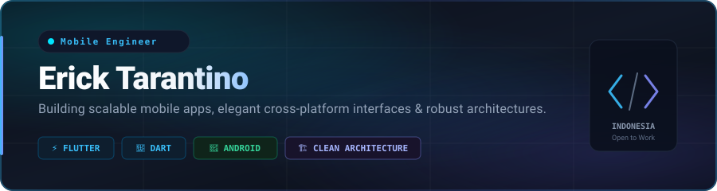

  

    

  

    
    &nbsp;
    
    &nbsp;
    
  

---

### 👨‍💻 Engineering Profile

Mobile & Software Engineer specializing in crafting performant cross-platform mobile solutions and modern web applications. Dedicated to building production-grade architectures with Clean Architecture patterns, offline-first local caching, and seamless user experiences.

- 📱 **Flagship Product:** Lead developer & architect of **[Dompetin](https://play.google.com/store/apps/details?id=com.dompetin.app)** — published on Google Play Store.
- ⚡ **Core Competencies:** Flutter/Dart ecosystem, Clean Architecture, BLoC / Provider state management, SQLite local caching, REST APIs.
- 🔒 **Security & Quality:** Offline-first architecture, local data encryption, modular codebase design, and strict SOLID principles.
- 📫 **Inquiries & Collaboration:** `erick.tarantino@gmail.com`

---

### 🛠️ Tech Stack & Ecosystem

  

 

| Category | Technologies & Tools |
| :--- | :--- |
| **Mobile & Cross-Platform** | Flutter, Dart, Android Native (Kotlin/Java), Material 3, State Management (Provider/BLoC) |
| **Frontend & Web** | HTML5, CSS3, JavaScript, TypeScript, Modern Responsive Layouts |
| **Data & Backend Services** | SQLite (Local Offline Cache), Firebase (Auth, Firestore, FCM), RESTful APIs, Node.js |
| **Tools & Workflow** | Git, GitHub Actions CI/CD, Android Studio, VS Code, Postman, Figma |

---

### 📱 Featured Product: Dompetin (Production App)

<table>
  <tr>
    <td width="100%" valign="top">
      

        <h3>💰 Dompetin — Smart Personal Finance & Budget Tracker</h3>
        

          
          
          
          
        

      

      

        <b>Dompetin</b> adalah aplikasi manajemen keuangan pribadi modern yang dirancang untuk membantu pengguna mengelola arus kas, anggaran bulanan, tabungan, dan hutang piutang dengan cepat dan aman secara offline.
      

      <ul>
        <li>📊 <b>Analitik Interaktif:</b> Visualisasi pengeluaran dan pemasukan dengan grafik real-time untuk keputusan finansial yang lebih bijak.</li>
        <li>💼 <b>Multi-Dompet & Kategori:</b> Manajemen rekening bank, e-wallet, dan uang tunai dalam satu dashboard terpadu.</li>
        <li>🔒 <b>Privasi & Keamanan Tinggi:</b> Menggunakan arsitektur <i>Offline-First</i> dengan penyimpanan terenkripsi di perangkat lokal, memastikan data finansial pengguna tetap privat dan aman.</li>
        <li>⚡ <b>Performa Cepat & Responsif:</b> Dibangun dengan Flutter dan arsitektur modular yang ringan, lancar, serta hemat baterai.</li>
      </ul>
      

         
        
      

    </td>
  </tr>
</table>

---

### 🐍 GitHub Contribution Activity

  

---

  
<i>Crafted with precision & passion by <b>Erick Tarantino</b> • <a href="mailto:erick.tarantino@gmail.com">Get in touch</a></i>

